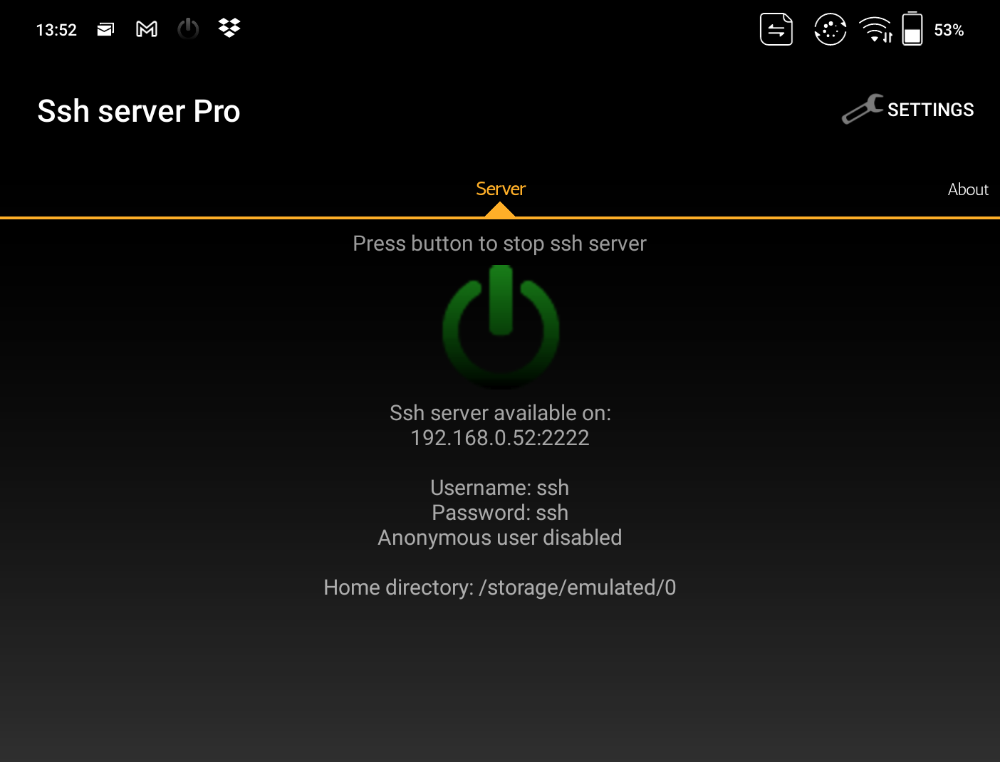
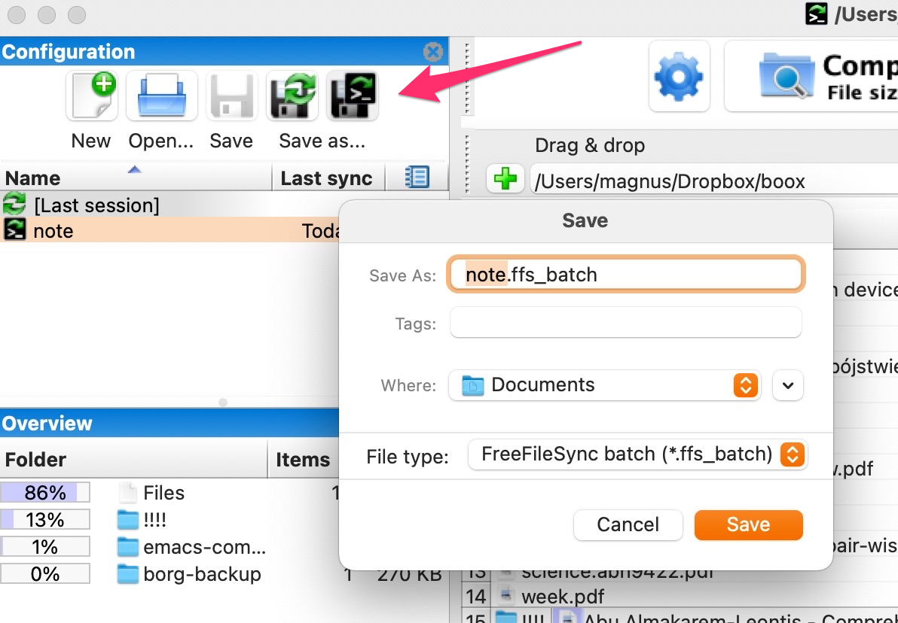

# boox-wifi-sync [mount your boox as a drive over Wifi]

Analogous to https://remarkablewiki.com/tech/ssh 

<b>What is great, you can even keep files open on your computer (Mac) and get "live" updates of editing at Boox (however you have to save a file at Boox). Pretty cool, hm?!</b>
  
Using ssh server at your Boox device (tested with Boox Note Air).

The device must be turn on, but does not have to be unlocked (when you use PIN).

Remember to start Ssh server after you reboot device.

You might need to restart ssh server if you move the device to a new Wifi network, to get an ip for that network.

# Manual setup (to be able sync in batch later)

Install [SSH server](https://play.google.com/store/apps/details?id=com.theolivetree.sshserverpro&hl=en&gl=US) using Play Store:

Start the server ssh at your device:

You can leave the default settings (not safe though! don't use for open public WiFi networks!)

First, you have to ssh to the device to 

	(base) ➜  boox-wifi-sync git:(main) ✗ ssh -p 2222 ssh@192.168.0.52 
	ssh@192.168.0.52's password: <type password, "ssh" in our case>
	
	PTY allocation request failed on channel 0
	/system/bin/sh: can't find tty fd: No such device or address
	/system/bin/sh: warning: won't have full job control
	
then you can type `ls` to see if you are connected to the device:

	:/storage/emulated/0 $ ls
	Alarms
	Android
	Books
	Download
	Music
	Notifications
	Pictures
	Push
	Screensaver
	Shop
	WifiTransfer
	data
	dicts
	driveinfo.calibre
	fonts
	kindle
	metadata.calibre
	note
	noteTemplate

if this looks like above, congrats you are connected to your Boox device using ssh.

Now you can mount the device as a drive to your Linux/Mac:
	
	# create folder
	mkdir -p ~/mnt/note/

	# set ip to the ip from the ssh server app
	echo 'ssh' | sshfs -o password_stdin -o allow_other,default_permissions -p 2222 ssh@192.168.0.52:/storage/emulated/0 /Users/magnus/mnt/note/
	# echo 'ssh' send this ssh as a passoword to sshfs

(on Mac you might have to install https://osxfuse.github.io)

see your notes, AI generated text

or pngs

see screensavers:

# Sync over WiFi with FreeFileSync

When the folder is mounted you can set up sync. 

I use [FreeFileSync](https://freefilesync.org) for that. 

You can use other tools that can diff/sync two folders, e.g. [Unison](https://www.cis.upenn.edu/~bcpierce/unison/), I prefer FFS though.

First open FreeFileSync and manually set up folders to sync.

click Compare 

click Synchronize.

Save this configuration "note" to (for example) `~/Documents/note.ffs_batch`.

# Sync over WiFi with FreeFileSync in batch mode

OK, now you can use `boox-wifi-sync.py` to run it all in batch.

Open now the script, edit configuration:

	# you can add more than one ips! for use only one ip still use a Python list e.g.
	# IPS = ['192.168.1.10']
	IPS = ['192.168.1.10', "192.168.0.52"]
	# path to your ffs_batch
	FFS_BATCH = "/Users/magnus/Documents/note.ffs_batch"
	MNT_PATH  = "/Users/magnus/mnt/note/"

and then run:

	(base) ➜  boox-wifi-sync git:(main) ✗ boox-wifi-sync.py
	PING 192.168.1.10 (192.168.1.10): 56 data bytes
	92 bytes from pl-waw10a-rt1.aorta.net (84.116.254.59): Destination Net Unreachable
	Vr HL TOS  Len   ID Flg  off TTL Pro  cks      Src      Dst
	 4  5  00 5400 5268   0 0000  3f  01 a634 192.168.0.178  192.168.1.10

	--- 192.168.1.10 ping statistics ---
	1 packets transmitted, 0 packets received, 100.0% packet loss
	192.168.1.10 is down!

	PING 192.168.0.52 (192.168.0.52): 56 data bytes
	64 bytes from 192.168.0.52: icmp_seq=0 ttl=64 time=192.788 ms

	--- 192.168.0.52 ping statistics ---
	1 packets transmitted, 1 packets received, 0.0% packet loss
	round-trip min/avg/max/stddev = 192.788/192.788/192.788/0.000 ms
	192.168.0.52 is up!
	Unmount successful for /Users/magnus/mnt/note/
	echo 'ssh' | sshfs -o password_stdin -o allow_other,default_permissions -p 2222 ssh@192.168.0.52:/storage/emulated/0 /Users/magnus/mnt/note/

you see first, the script will ping ips provided with IPS. The reason for that is that I noted on my Mac when try to mount using `sshfs` and the device under ip is not reachable this can easily hang my Mac and the only solution was to restart the whole machine.

The FFS will be open in the batch mode, see this icon in your menu bar:

click on it to get sync window:

Enjoy!

# Tips

Remember to start Ssh server after you reboot device.

You might need to restart ssh server if you move the device to a new Wifi network, to get an ip for that network.

# SSH problem to connect

If you have a problem to connect with ssh:

	$ ssh -p 2222 ssh@192.168.203.134
	The authenticity of host '[192.168.203.134]:2222 ([192.168.203.134]:2222)' can't be established.
	DSA key fingerprint is SHA256:Qoy8QodD0Gy+qrzHtOMTCX0Fo10fyzJvDxV04JbUjtQ.
	Are you sure you want to continue connecting (yes/no/[fingerprint])? yes
	Warning: Permanently added '[192.168.203.134]:2222' (DSA) to the list of known hosts.
	ssh@192.168.203.134's password:
	PTY allocation request failed on channel 0
	/system/bin/sh: can't find tty fd: No such device or address
	/system/bin/sh: warning: won't have full job control
	:/storage/emulated/0 $ Connection to 192.168.203.134 closed.

then open `~/.ssh/config` with a text editor and set `HostKeyAlgorithms` for your ip of your device:

     Host 192.168.0.52
       HostKeyAlgorithms=+ssh-dss
